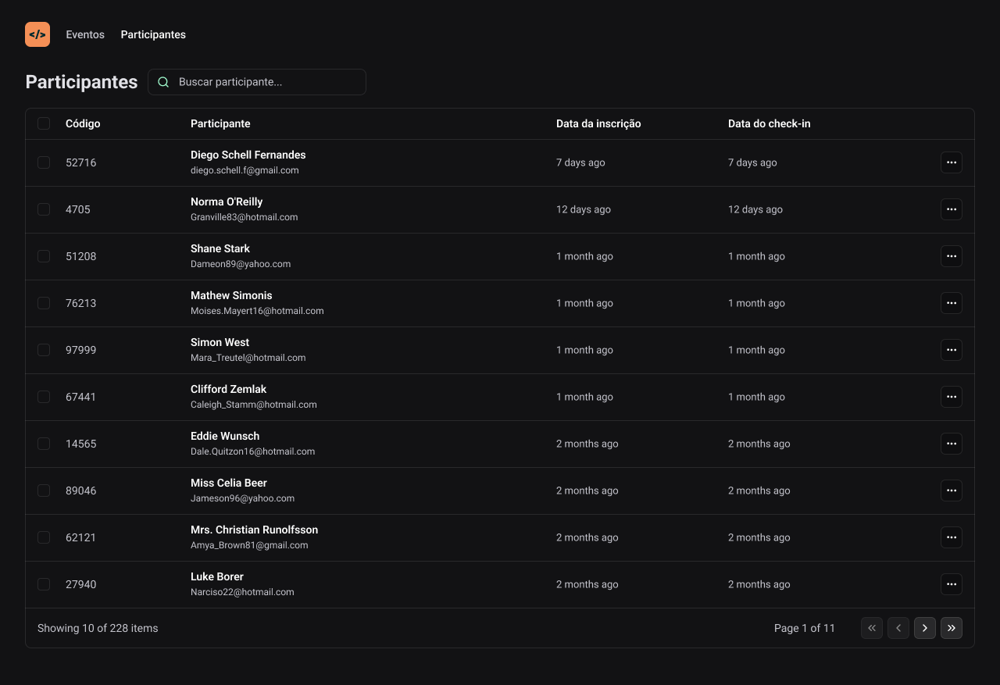

<h1 align='center'>NLW - Pass in web</h1>



<p>A aplicação Nlw é um projeto desenvolvido durante a Next Level Week, um evento da Rocketseat, onde o objetivo é criar uma aplicação de verificação de convidados para eventos.</p>

## :page_facing_up: Explicação

A função principal do projeto é a listagem de convidados de um evento, tendo filtros por nome ou e-mail do participante.
Com a utilização de URL states para uma melhor experiência ao usuario

## :dart: Passos

:heavy_check_mark: Tela de listagem dos participantes;\
:heavy_check_mark: Criação dos componentes;\
:heavy_check_mark: Estilização da tela de particpantes;\
:heavy_check_mark: Listagem com chamada à API;\
:heavy_check_mark: Criação de funções;\
:heavy_check_mark: Filtragem por parametros da API;\
:heavy_check_mark: Utilização de URL states;

## :rocket: Tecnologias

As seguintes ferramentas foram utilizadas neste projeto:

- [React](https://react.dev/)
- [Vite](https://vitejs.dev/)
- [TypeScript](https://www.typescriptlang.org/docs/)
- [TailwindCSS](https://tailwindcss.com/)

## :closed_book: Requisitos ##

Antes de começar, você precisa ter [Git](https://git-scm.com) e [Node](https://nodejs.org/en/) instalados em seu computador.

## :checkered_flag: Getting Started ##

```bash
# Clone o projeto
$ git clone https://github.com/joaoviictorss/NLW-pass-in-web

# Accesso
$ cd NLW-pass-in-web

# Instalando dependencias
$ npm install

# É necessário a execução da APi criada na trilha de node do NLW - Unite para o funcionamento correto da aplicação
# link do repositorio da API - https://github.com/rocketseat-education/nlw-unite-nodejs

# Rodando o projeto
$ npm run start

```
